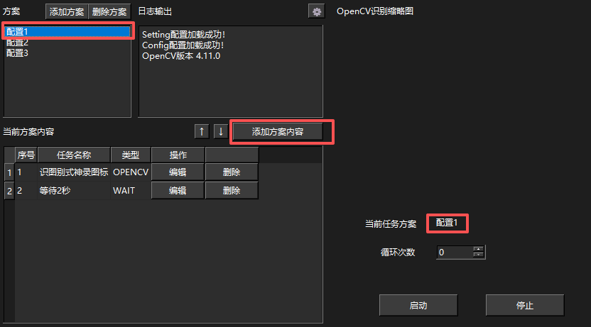
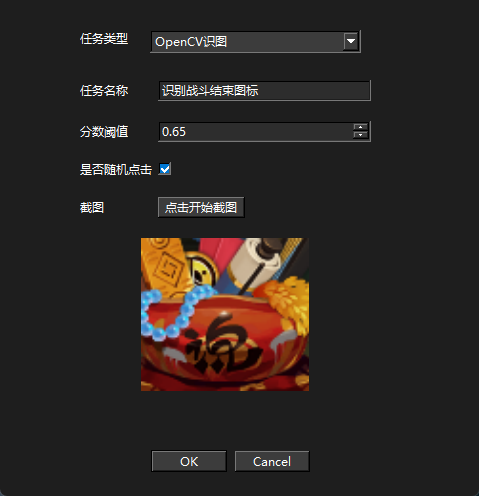
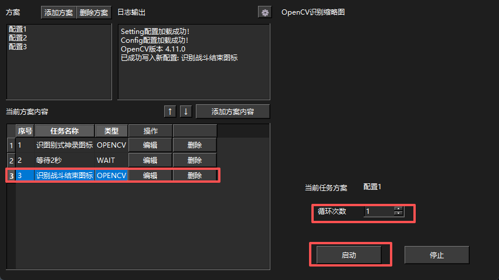

# 阴阳师脚本 (Onmyoji Script)

仅适用于《阴阳师》桌面版游戏的自动化脚本工具。

## 使用说明

1. 下载最新发行版本的 `yys-script-x64.rar` 完整的解压到文件夹
2. 右键使用管理员身份启动 `yys-script.exe` 即可使用
3. **重要：** 必须使用管理员身份启动!

## 注意事项

⚠️ **重要提醒：**
- 目前版本需要保持《阴阳师》桌面版始终在最前台运行
- 暂未测试是否会被游戏检测（"鬼使黑"）
- 请合理使用，遵守游戏规则
- 使用风险自负

## 更新计划

🔮 **未来版本将加入以下功能：**
1. 更隐蔽的鼠标策略
2. 识别失败时的自定义处理
3. 全自动砸豆子
4. 条件判断和步骤跳转逻辑
5. 任务执行途中,做无意义的事情,拟人化
6. 欢迎在issues提出

## 使用说明
🔮 **软件主要功能就是 识别->等待->点击**
1. 选择方案->添加方案内容

2. 输入需要的数据 分数阈值是0-1之前的数字，建议填0.55-0.75之间，点击开始截图选择需要识别的图片 ok保存即可

3. 设置循环次数 次数为0时是无限循环 点击启动即可开始执行脚本逻辑

4. 中途可以加入是否有勾协的判断，防止被鬼使黑

## 脚本逻辑完全依靠自主设置 自由发挥 每次爬塔或者周年庆999只需要简单的截图设置下 即可完成，解放双手

---

## 更新日志
🔮 **v1.3**
1.使用DLL获取游戏截屏
2.添加ocr识别功能 鸣谢@umi-ocr

*本工具仅供学习交流使用，请勿用于商业用途。*