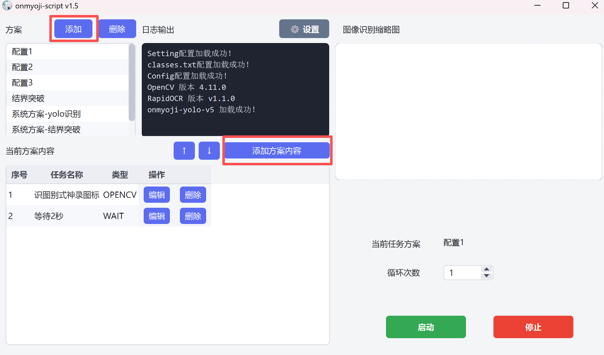
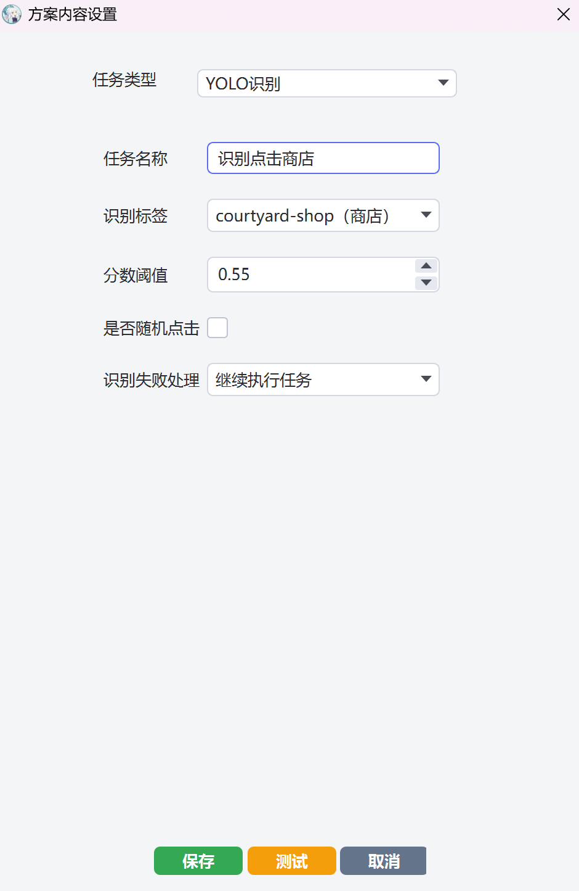
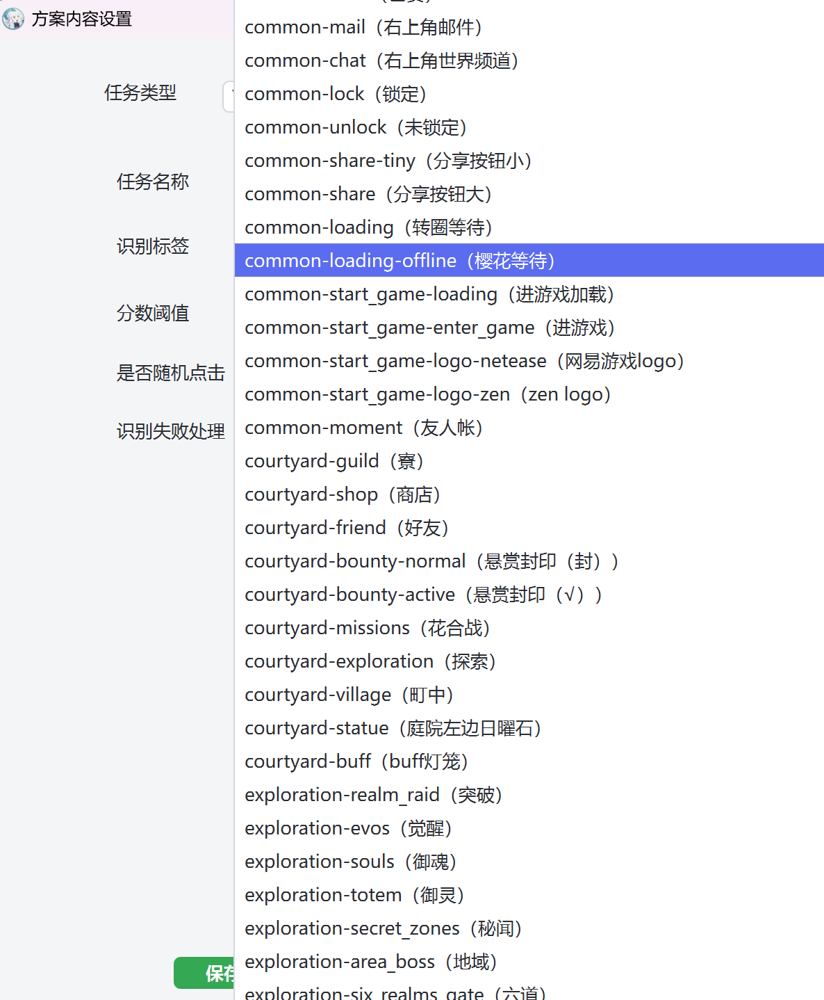
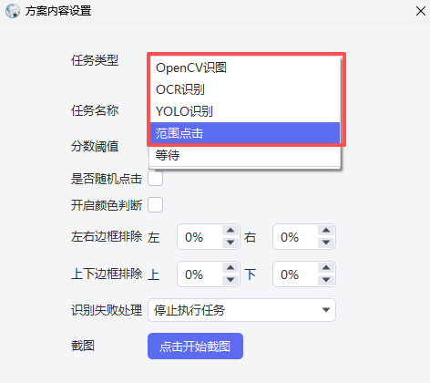

# 阴阳师脚本 (Onmyoji-Script)

仅适用于《阴阳师》桌面版游戏的自动化脚本工具。

### **注意：新版桌面模拟器是MuMu模拟器的二次封装，理论上不支持(没测试，有测试过的可以提一下issues)，旧桌面版正常**
### **注意：如已更至 新桌面版本，那么请移步MAA-YYS使用模拟器版本**

### 主要在Github更新 [Ferrarii-430/onmyoji-script](https://github.com/Ferrarii-430/onmyoji-script)

> ⚠️ 本工具仅供学习交流使用，请勿用于商业用途，使用风险自负。

> ⚠️ 为支持桌面版最小化运行，需要进行注入操作，风险系数较高，请注意。

## 目录

- [快速开始](#快速开始)
- [使用教程](#使用教程)
- [注意事项](#注意事项)
- [更新计划](#更新计划)
- [更新日志](#更新日志)

## 快速开始

1. 下载最新发行版本的 `yys-script-x64.zip`，完整解压到文件夹。
2. 【**右键使用管理员身份**启动】 `yys-script.exe` 即可使用（**必须以管理员身份启动，否则无法注入**）。
3. 使用默认设置，支持游戏窗口最小化时运行脚本。

## 使用教程

软件的核心逻辑就是「**识别 → 点击 → 等待**」不断循环。脚本逻辑完全依靠自主设置、自由发挥，每次爬塔或者周年庆 999 只需简单截图设置即可完成，解放双手。

1. 选择方案 → 添加方案内容。

   

2. 输入需要的数据。分数阈值是 0~1 之间的数字，建议填 0.55~0.75；点击「开始截图」选择需要识别的图片，OK 保存即可。

   
   

3. 设置循环次数（次数为 0 时表示无限循环），点击「启动」即可开始执行脚本逻辑。

   

4. 中途可以加入「是否有勾协」的判断，防止被鬼使黑。

## 注意事项

- 短暂测试目前还未被「鬼使黑」，桌面版时间长了肯定会吃邮件。怕就别用，用就别怕！
- 请合理使用，遵守游戏规则。
- 使用风险自负。

## 更新计划

未来版本计划加入以下功能，也欢迎在 issues 中提出建议：

- [✅] 全自动突破
- [ ] 更隐蔽的鼠标策略
- [ ] 全自动砸豆子
- [ ] 任务执行途中做无意义的事情，拟人化
- [❌] 全自动日常托管 (已经出了减负，功能意义不大)

## 更新日志

### v1.5.2
- **添加系统方案**：自动御魂，需要在魂X界面启动，需提前配备好御魂和队伍 (￣▽￣)。
- **新增**：新的鼠标点击模式(hook后台点击)，优化点击性能。
- **优化**：优化OpenCV的识别方式，提高识别率，旧的识别图像需要重新截图才能适配新的识别率提升。
- **优化**：界面有的新的优化，添加功能使用注解。
- **Bug 修复**：
    1. 系统方案-自动结界偶尔出现的点击异常。
    2. 系统方案-自动结界偶尔频繁检测界面。
    3. 2k，4k屏幕下的点击异常。
    4. 优化打包build.bat脚本。
    5. 修复运行时包含中文路径，脚本异常闪退异常。 

### v1.5.1
- **添加自动斗技**：需要自备全动斗技阵容。
- **新增**：系统方案添加额外配置功能。
- **新增**：打包脚本。
- **Bug 修复**：
  1. 修复固定配置异常。
  2. 修复YOLO识别标签异常。
- **性能优化**：
  1. 提升了截图的获取速度
  2. 更新 注入器
  3. 更新 注入文件
  4. 移除了失败重试

### v1.5

- **界面优化**：界面更加美观。
- **Bug 修复**：
  1. 修复获取 DX11 数据的线程安全异常（可能导致画面花屏）。
  2. 修复截图异常。
  3. 修复多种异常导致的闪退。
  4. 修复运行过程中线程假死。
  5. 修复无法停止任务。
- **新增**：全自定义 YOLO 标签识别。
- **优化**：全自动突破，目前基本可用。
- **新增**：OCR 识别添加了区域限制。

### v1.4

1. 添加 YOLO v5 识别，模型来自 [shuiyuewuyan1/yolo-games-weights](https://github.com/shuiyuewuyan1/yolo-games-weights)，感谢 🙏 大佬。
2. 添加全自动突破功能。

### v1.3

1. 使用 DLL 获取游戏截屏。
2. 添加 OCR 识别功能，鸣谢 [@RapidOCR](https://github.com/RapidAI/RapidOCR)。
